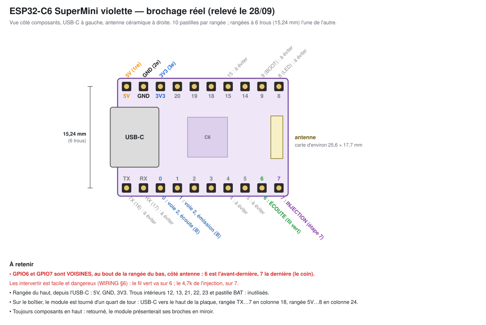
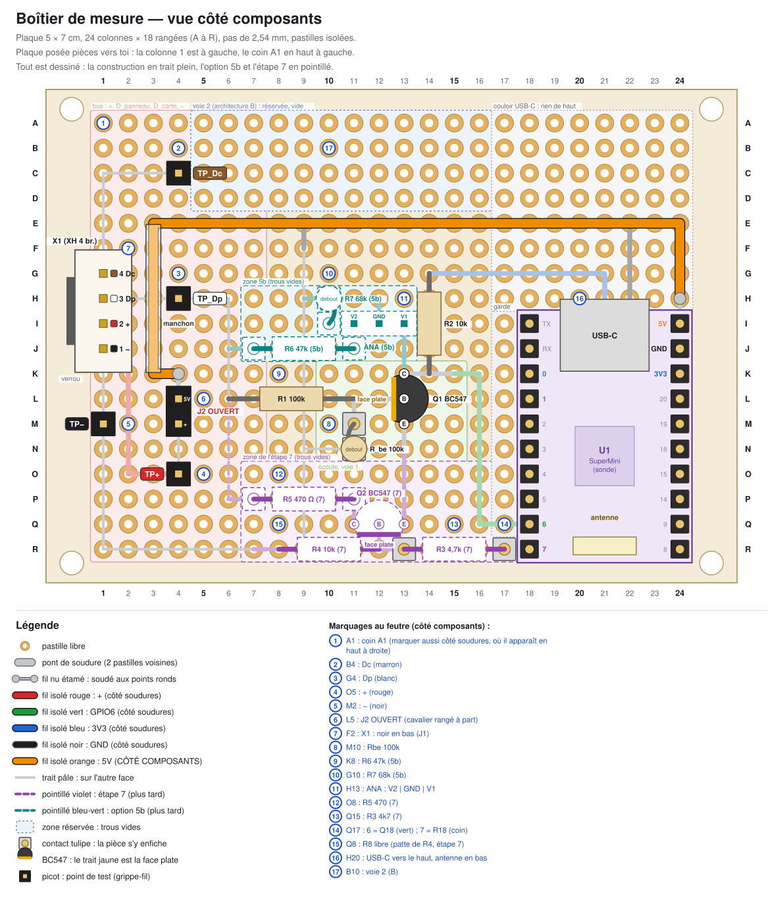
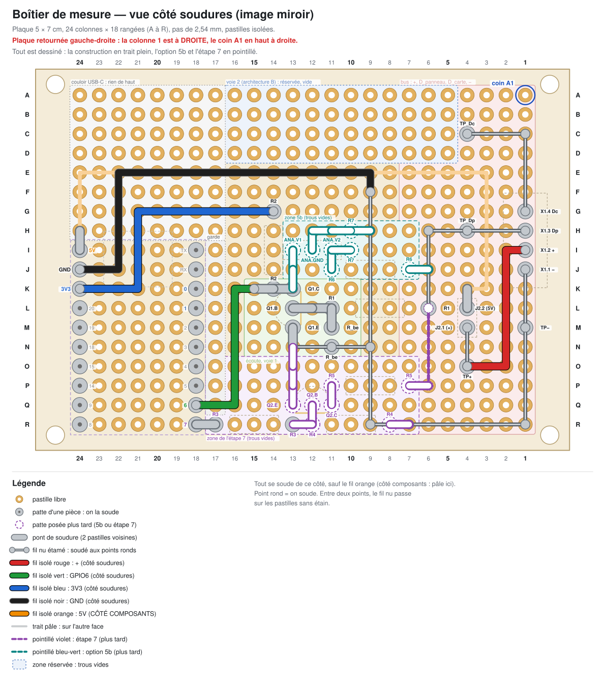
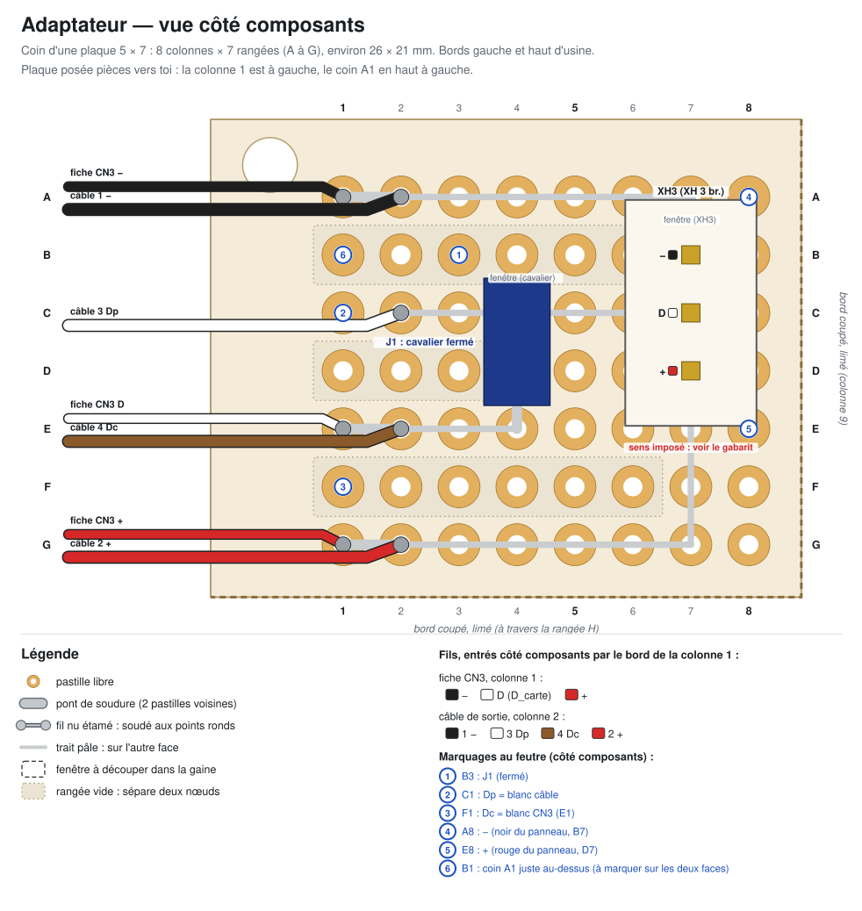
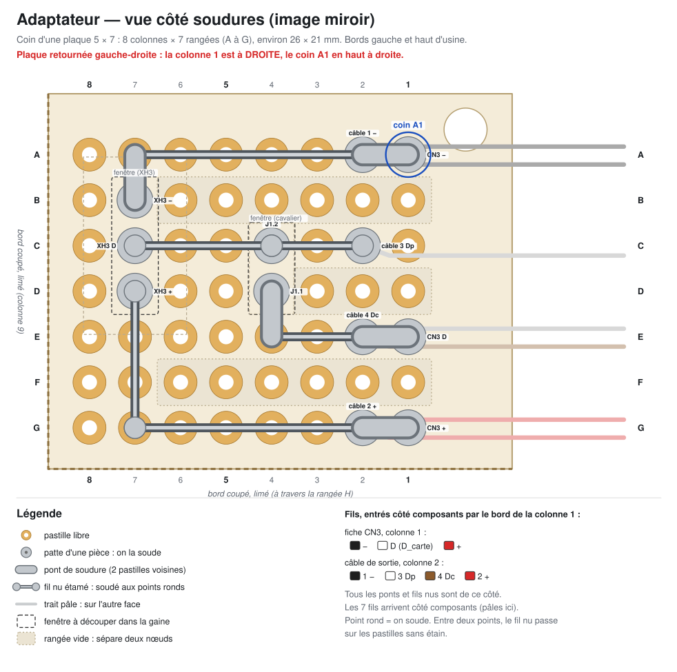
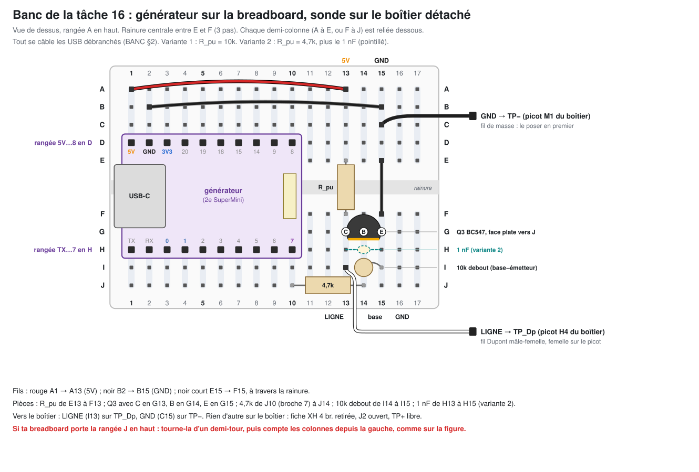

# Fabrication des cartes

**Sous-projet 1 : reconnaissance de la ligne `D`.** Ce guide dit où va chaque
pièce, dans quel ordre la souder et quels trous toucher au multimètre. Il couvre
l'adaptateur, le câble de sortie, le boîtier de mesure et le banc de la tâche 16.
Le schéma et les valeurs sont dans [WIRING.md](WIRING.md), qui fait foi. Les
règles de sécurité sont dans [SECURITE.md](SECURITE.md). Les relevés vont dans
[RECONNAISSANCE.md](RECONNAISSANCE.md).

- **Aucune tension secteur sur ces cartes.** Elles ne voient que le bus basse
  tension de `CN3` (5 V probable, à mesurer à l'étape 3b). Tout se soude sur
  la table, hors de la hotte.
- **La pose se fait selon les règles** : hotte débranchée (règles 1 et 4),
  câble selon la règle 5, contrôles d'isolement de la règle 7.
- Les plans ont été vérifiés par un script : connexions, courts-circuits,
  règle 10. Ils passent sans erreur dans les trois états : construction,
  option 5b, étape 7.

## 1. Par où commencer

1. **Préparer les SuperMini** (§5) : barrettes mâles, puis contrôle électrique
   du module.
2. **Construire le boîtier de mesure** (§6), puis le contrôler (§9.2).
3. **Monter le banc de la tâche 16** (§10). Il n'a besoin que du boîtier et du
   générateur.
4. **Câble de sortie et adaptateur** (§7 et §8), quand la longueur du câble est
   connue (étape 0, ligne 6b de `RECONNAISSANCE.md`).
5. **Contrôles avant pose** (§9.1), puis la pose de l'étape 2.

## 2. Pièces

D'après [WIRING.md §11](WIRING.md#11-nomenclature) et les plans.

### Adaptateur

| Pièce | Repère | Quantité | Remarque |
|---|---|---|---|
| coin de plaque à pastilles 5 × 7 cm (pastilles isolées) | — | 8 × 7 trous | découpé dans une seconde plaque (§8.3) |
| fiche XH 3 broches, 3 fils sertis (noir, blanc, rouge) | `CN3` | 1 | va sur `CN3` ; au moins 6 cm de fil |
| embase XH 3 broches **droite** (entrée par le dessus) | `XH3` | 1 | reçoit la fiche du panneau |
| barrette mâle 2 broches 2,54 mm et cavalier | `J1` | 1 | cavalier fermé |
| fil nu étamé, ou pattes de résistances coupées | — | 10 cm | ponts et fils nus |
| gaine thermorétractable d'environ 25 mm | — | 2 × 4 cm | deux couches |
| ruban Kapton, colle chaude, un collier | — | — | gaine et arrêt de traction |
| seconde fiche XH 3 broches, préparée comme la première | — | 1 | conseillée : contrôle d) si les fils de la première sont courts |

### Câble de sortie

| Pièce | Quantité | Remarque |
|---|---|---|
| fil UL1007 (ou UL1015), au moins 300 V : noir, rouge, blanc, marron | 4 × (longueur de l'étape 0 + marge) | 22 AWG, commandé le 27/09 |
| gaine VW-1, ou gaine thermorétractable de 3 à 6 mm | toute la longueur, deux épaisseurs | règle 5 |
| fiche XH 4 broches et 4 fils sertis | 1 | côté boîtier de mesure |
| gaine thermorétractable fine (2 à 3 mm) | 4 × 2 cm | une par soudure de fil |
| colliers | selon le cheminement | |

### Boîtier de mesure

| Pièce | Repère | Quantité | Remarque |
|---|---|---|---|
| plaque à pastilles 5 × 7 cm, 18 × 24 trous, pastilles isolées | — | 1 | |
| ESP32-C6 SuperMini violette (sonde) | `U1` | 1 | |
| barrettes mâles 10 broches | — | 2 | souvent livrées avec le module |
| barrettes femelles 10 broches, 2,54 mm | — | 2 | |
| embase XH 4 broches droite | `X1` | 1 | |
| picots : barrette mâle 2,54 mm coupée en morceaux d'une broche | `TP−`, `TP+`, `TP_Dp`, `TP_Dc` | 4 | |
| barrette mâle 2 broches et cavalier | `J2` | 1 | cavalier rangé hors de la plaque |
| BC547 | `Q1` | 1 | |
| résistance 100k | `R1` | 1 | |
| résistance 100k (`R_be`), plus 47k et 15k de rechange | `R_be` | 1 + 2 | sur support : on change sans dessouder |
| résistance 10k | `R2` | 1 | |
| barrette tulipe sécable, 20 ou 40 contacts | — | 1 | 10 contacts utiles, en 8 morceaux ; une coupe perd souvent un contact |
| fil isolé rigide (fil de câblage) : rouge, vert, bleu, noir, orange | — | 10 cm de chaque | |
| gaine thermorétractable fine | — | 1,5 cm | manchon du fil orange |
| fil nu étamé, 0,5 à 0,6 mm | — | 40 cm | |
| ruban Kapton | — | — | coque de l'USB-C |
| entretoises et vis en nylon, au diamètre des trous de coin ; feuille isolante | — | 4 | fixation |

Plus tard, sur la même plaque :

| Pièce | Repère | Quand |
|---|---|---|
| 47k et 68k (100k et 33k si `+` = 12 V) ; barrette mâle 3 broches | `R6`, `R7`, `ANA` | option 5b (analyseur) |
| BC547 ; 4,7k ; 10k ; 470 Ω (et 220 Ω de rechange) | `Q2`, `R3`, `R4`, `R5` | étape 7, ou banc (critère 5) |

Contacts tulipe : support de `R_be` (M11-N11) et contacts de `R3` (R13, R17) à la
construction ; contacts de `R6` (J7, J11) et support de `R7` (H10-I10) à
l'option 5b ; contacts de `R5` (P7, P11) à l'étape 7.

### Banc de la tâche 16

| Pièce | Quantité |
|---|---|
| second SuperMini violette (générateur) et ses 2 barrettes mâles 10 broches | 1 |
| breadboard (plaque d'essai sans soudure) | 1 |
| BC547 (`Q3`) ; 4,7k (base) ; 10k (base-émetteur) | 1 de chaque |
| pull-up de ligne : 10k (variante 1) ; 4,7k et 1 nF (variante 2) | 1 de chaque |
| fils Dupont : 3 mâle-mâle, 2 mâle-femelle | 5 |

## 3. Outils

| Outil | Pour quoi |
|---|---|
| fer à souder réglable, panne fine (conique ou biseau de 1 à 2 mm), 320 à 350 °C | tout |
| étain fin (0,5 à 0,8 mm) à âme décapante ; flux en stylo | soudures, ponts |
| tresse à dessouder (et pompe, si tu en as une) | retirer un pont d'étain |
| éponge humide ou laine de laiton | nettoyer la panne |
| pince coupante à ras ; pince plate ; brucelles | couper et plier les pattes |
| pince à dénuder | fils isolés : 3 mm dénudés |
| troisième main ; pâte adhésive (type Patafix) | tenir la plaque et les pièces |
| loupe, ou photo au téléphone agrandie | chercher les ponts d'étain |
| multimètre et 2 grippe-fils | contrôles |
| cutter, règle métallique, lime | découpe de l'adaptateur |
| feutre fin permanent | coin A1, marquages |
| décapeur thermique, ou briquet tenu à distance | gaines thermorétractables |
| lunettes ; fenêtre ouverte | les pattes coupées sautent ; fumées de flux |

## 4. Lire les plans

- **Un trou se note rangée puis colonne** : C7 = rangée C, colonne 7.
- **Vue côté composants** (pièces vers toi) : colonnes de gauche à droite (1 à
  24), rangées de haut en bas (A à R). C'est la plaque telle qu'on la voit
  quand on pose les pièces.
- **Vue côté soudures** : la plaque est retournée, donc l'image est **en
  miroir**. La colonne 1 passe à droite. Pour souder, on suit le dessin côté
  soudures, où les colonnes sont déjà inversées.
- **Coin A1** : le marquer au feutre sur les deux faces avant de commencer.
  Côté soudures, il est en haut à droite.
- **Trous de la rangée J et barrettes `J1`, `J2`** : ici, « trou J1 » est un
  trou (rangée J, colonne 1). `J1` et `J2`, en police de code, sont les
  barrettes à cavalier.

| Dessin | Nom | Comment le faire |
|---|---|---|
| trait gris épais entre deux pastilles | pont de soudure | entre deux pastilles **voisines** seulement. Le plus sûr : replier la patte de la pièce sur la pastille voisine, ou poser un bout de fil nu, puis souder |
| trait gris fin, points ronds aux bouts | fil nu étamé | fil rigide, tendu à plat. On soude aux points ronds seulement. Entre deux points, il passe sur les pastilles sans étain |
| trait de couleur | fil isolé | posé en dernier, soudé à ses deux bouts ; 3 mm dénudés, isolant jusqu'à la pastille |
| trait pâle | autre face | on ne le soude pas de ce côté |
| pointillé violet | étape 7 | trous vides jusque-là |
| pointillé bleu-vert | option 5b | trous vides jusque-là |
| cercle bleu numéroté | marquage au feutre | texte dans la légende du dessin |

**Gestes de base :**

- **Une soudure** : panne propre et étamée. Poser la panne contre la pastille
  **et** la patte, 1 s. Amener l'étain sur la jonction, pas sur la panne.
  Retirer l'étain, puis la panne : 3 s en tout. Bonne soudure : un petit cône
  brillant qui enrobe la patte.
- **Tenir une pièce** : replier ses pattes à 45° côté soudures, ou la caler
  avec de la pâte adhésive côté composants.
- **Fil nu** : le redresser en le tirant entre deux pinces. Le souder à un bout,
  le tendre, le souder à l'autre bout, puis aux points ronds du milieu.
- **Pont d'étain de trop** : flux, tresse posée dessus, panne chaude sur la
  tresse. Recontrôler ensuite.
- **Après chaque groupe de soudures** : regarder à la loupe, surtout entre deux
  pastilles voisines de nœuds différents (tableau du §9.3).

## 5. Préparer les SuperMini

### 5.1 Brochage réel

Relevé le 28/09 sur la photo de Majid. Vue côté composants, USB-C à gauche,
antenne céramique à droite :

| Rangée | Pastilles, depuis l'USB-C |
|---|---|
| du haut | 5V · GND · 3V3 · 20 · 19 · 18 · 15 · 14 · 9 · 8 |
| du bas | TX · RX · 0 · 1 · 2 · 3 · 4 · 5 · 6 · 7 |

- Les deux rangées sont à 6 trous l'une de l'autre (15,24 mm).
- Trous intérieurs 12, 13, 21, 22, 23 et pastille BAT : inutilisés.
- **GPIO6 et GPIO7 sont voisines**, au bout de la rangée du bas, côté antenne :
  6 est l'avant-dernière, 7 la dernière (le coin). Les intervertir est facile
  et dangereux ([WIRING.md §6](WIRING.md#6-étage-dinjection-voie-1--gpio7-vers-d_panneau-étape-7-seulement)).
- Le module se pose toujours **composants en haut**. Retourné, il présenterait
  ses broches en miroir.

| Broche | Rôle |
|---|---|
| 6 | écoute (fil vert du boîtier) |
| 7 | injection, étape 7 seulement (contact tulipe de `R3`) |
| GND | `TP−` |
| 5V | `J2`, ouvert |
| 3V3 | 10k de collecteur (`R2`) |
| 0 et 1 | voie 2, architecture B seulement |

**Marquer les deux modules** au dos (S pour la sonde, G pour le générateur) :
ils sont identiques.

### 5.2 Barrettes de la sonde (et barrettes femelles du boîtier)

Les barrettes femelles servent de gabarit : le module entrera toujours tout
droit, sans forcer.

1. Enficher les deux barrettes mâles, côté long, dans les deux barrettes
   femelles. Le côté court des broches passera dans le module.
2. Poser les barrettes femelles **sans les souder** sur la plaque du boîtier :
   colonnes 18 et 24, rangées I à R.
3. Poser le module sur les broches mâles : composants en haut, **USB-C vers le
   haut de la plaque** (rangée A), antenne vers le bas (rangée R).
4. Souder les broches mâles sur le module : deux broches opposées d'abord,
   vérifier que le module est bien à plat, puis les autres. 3 s par broche.
5. Sans rien bouger, retourner l'ensemble (il repose sur le module) et souder
   les barrettes femelles sur la plaque : deux broches opposées d'abord,
   vérifier qu'elles sont plaquées et droites, puis les autres.
6. Retirer le module en le soulevant des deux côtés à la fois.

C'est la seule exception à l'ordre « des pièces les plus basses aux plus
hautes » (§6.2). Pour souder la suite, caler la plaque retournée avec de la
pâte adhésive : elle repose sur les barrettes.

### 5.3 Contrôle électrique du module (WIRING §9, contrôle 17)

Sur la sonde, **juste après ses barrettes, avant toute autre soudure du
boîtier**. Module seul sur l'USB du Mac, rien d'autre de branché, firmware
`sonde` chargé ([BANC.md §3](BANC.md#3-logiciels-et-ports)). Calibre 20 V
continu.

Le plus sûr : poser le module seul sur la **breadboard vide**, à la place du
banc, avant d'y mettre le générateur (rangée 5V…8 en D, rangée TX…7 en H,
USB-C côté colonne 1 : §10). Chaque broche se lit alors dans un trou libre de
sa colonne, par un fil Dupont où l'on accroche le grippe-fil. Plus de risque
de glisser entre deux broches.

| Mesure | Broche | Trou de la breadboard | Attendu | Sinon |
|---|---|---|---|---|
| COM | `GND` (2e de la rangée du haut) | colonne 2, A à C | — | — |
| repère | `3V3` (3e de la rangée du haut) | colonne 3, A à C | environ 3,3 V | 0 V : COM n'est pas sur `GND`, ou le module ne démarre pas |
| 17 | broche 6 (9e de la rangée du bas) | colonne 9, I ou J | environ 3,3 V (pull-up interne) | brochage mal lu : **ne plus rien souder** |
| 17 | broche 7 (10e, le coin) | colonne 10, I ou J | 0 V (sortie à l'état bas) | idem |
| à noter | `5V` (1re de la rangée du haut) | colonne 1, A à C | 5,0 V environ (VBUS direct) ou 4,7 V (diode) | |

Sans breadboard : grippe-fil COM sur la broche `GND`, pointe fine, une broche à
la fois. `5V` et `GND` sont voisines : ne jamais poser la pointe en travers.

Ensuite :

- **Contrôle 16** : ruban Kapton sur la coque métallique de l'USB-C (elle est
  reliée à `GND`), bouche libre.
- **Détrompeur, si tu le veux** : couper au ras la broche mâle `TX` du module,
  et boucher le contact femelle I18 avec un bout de patte coupée, enfoncé à
  fond. Tourné d'un demi-tour, le module n'entre plus.
- Noter le résultat dans `RECONNAISSANCE.md` (étape 2, ligne 17).

### 5.4 Barrettes du générateur

La breadboard sert de gabarit, une fois le contrôle du §5.3 fait. Enficher
les deux barrettes mâles, côté long, dans les rangées D et H, colonnes 1 à 10
(la place du banc, §10). Poser le module dessus, composants en haut, et souder
vite (3 s par broche) : le plastique de la breadboard n'aime pas la chaleur. Le
module reste en place pour le banc.

## 6. Boîtier de mesure

### 6.1 Plans

La plaque est rangée en bandes, de gauche à droite :

- **Colonnes 1 à 7 : le bus.** `X1` au bord gauche, verrou dehors. Picots
  `TP_Dc` en C4, `TP_Dp` en H4, `TP−` en M1, `TP+` en O4. `J2` en L4-M4, ouvert.
  Rail `D_panneau` en colonne 6. Le `−` longe le bord gauche, puis le bord bas,
  jusqu'à l'épine de masse (colonne 9).
- **Colonnes 10 à 16 : les étages.** Écoute : `R1` couchée de L6 à L11 (le seul
  chemin du bus vers l'étage), `Q1` en K13-M13, `R_be` sur support en
  M11-N11, `R2` de G14 à K14. Zone 5b : H7 à J13. Zone de l'étape 7 : O7 à R17.
- **Colonne 17 vide** (garde), puis **la SuperMini** sur ses barrettes femelles
  (colonnes 18 et 24). USB-C vers le haut, couloir A17 à H24 libre ; antenne au
  bord bas.
- **GPIO7 est le coin (R18)**, relié au contact tulipe R17 de `R3`. **GPIO6
  (Q18)** arrive par le fil vert. Le nœud du bus le plus proche d'une GPIO est
  à 11 colonnes.
- **Zone réservée à la voie 2** (architecture B seulement) : A5 à D16, vide.

| Pièce | Trous | Sens, remarque |
|---|---|---|
| `U1` SuperMini | colonne 18 : TX (I18) … 6 (Q18), 7 (R18) ; colonne 24 : 5V (I24), GND (trou J24), 3V3 (K24) … 8 (R24) | composants en haut, USB-C vers la rangée A |
| `X1` embase XH 4 broches | G1 (4, `D_carte`), H1 (3, `D_panneau`), I1 (2, `+`), trou J1 (1, `−`) | verrou vers le bord gauche |
| `TP_Dc`, `TP_Dp`, `TP−`, `TP+` | C4, H4, M1, O4 | picots |
| `J2` | L4 (5V de la sonde), M4 (`TP+`) | ouvert ; cavalier rangé hors de la plaque |
| `R1` 100k | L6 à L11 | couchée |
| `R_be` 100k | support en M11-N11 | debout : corps sur N11, patte repliée dans M11 |
| `Q1` BC547 | C en K13, B en L13, E en M13 | debout, face plate vers la gauche, 4 à 5 mm de pattes |
| `R2` 10k | G14 (côté 3V3) à K14 | couchée |
| contacts de `R3` | R13 et R17 | soudés à la construction, vides jusqu'à l'étape 7 |

### 6.2 Ordre de soudure

Pattes pas encore coupées : certaines servent de ponts au §6.3.

1. **Barrettes et contrôle du module** : §5.2 et §5.3 (déjà faits).
2. **`R1` et `R2`, couchées.** Plier les pattes au bon écart (5 pas pour `R1`,
   4 pas pour `R2`), corps plaqué. Mesurer chaque résistance avant de la poser :
   les couleurs se lisent mal. Garder longue la patte L11 de `R1` : repliée côté
   soudures, elle fera les ponts L11-L12-L13.
3. **Supports tulipe.** Le support 2 contacts de `R_be` en M11-N11. Puis les
   deux contacts de `R3` : les enficher sur `R3` (la 4,7k de l'étape 7), poser
   l'ensemble (contacts en R13 et R17), souder les contacts, retirer `R3`. Pas
   d'étain dans l'ouverture des contacts.
4. **`X1`**, verrou vers le bord gauche, corps plaqué. Aussitôt, calibre
   200 Ω : G1-H1, H1-I1, I1-trou J1 : **OL**. Si le chiffre 1 moulé sur
   l'embase n'est pas du côté du trou J1, garder quand même le verrou dehors :
   c'est la fiche du câble qu'on câble d'après les trous (§7).
5. **Picots** (C4, H4, M1, O4) **et `J2`** (L4-M4) : souder une broche,
   vérifier qu'elle est droite, puis finir.
6. **`Q1` en dernier** : debout, 4 à 5 mm de pattes, C en K13, B en L13, E en
   M13, **face plate vers la gauche** (vers la colonne 12). 3 s par patte.
   Contrôle 15 : la face plate est du bon côté.

Restent vides : R8, K4, H24, et tous les trous de l'option 5b et de l'étape 7.

Ce plan suppose des BC547. Un 2N3904 a ses pattes dans l'autre ordre (E-B-C) :
il irait dans les mêmes trous, face plate de l'autre côté.

### 6.3 Fils nus et ponts (côté soudures)

Sur les pattes déjà soudées : patte repliée sur la pastille voisine, ou fil nu.

| Nœud | Trajet | Souder en | Remarque |
|---|---|---|---|
| `−` | trou J1 → M1 → R1 → R7 → R9 | trou J1, M1, R1, R7, R9 | le long du bord gauche, puis du bord bas. En R8 : le fil passe au bord de la pastille, côté bord de la plaque, **sans étain** ; le trou reste libre pour `R4` (étape 7) |
| épine de masse | R9 → N9 → H9 → F9 (colonne 9) | R9, N9, H9, F9 | H9 : point prévu pour l'option 5b |
| barre de masse de l'écoute | N9 → N11 → N13, puis pont M13-N13 | N9, N11, N13 | émetteur de `Q1` et `R_be` à la masse |
| `D_panneau` | H1 → H4 (`TP_Dp`) | H1 et H4 seulement | pas d'étain en H2 ni en H3 |
| rail `D_panneau` | H4 → H6 → J6 → L6 (colonne 6) | H6, J6, L6 | L6 : patte de `R1` ; J6 : point prévu pour `R6` (5b) |
| `D_carte` | G1 → C1 → C4 (`TP_Dc`) | G1, C1, C4 | |
| `+` | O4 (`TP+`) → M4 (`J2`) | O4, M4 | |
| écoute | ponts L11-L12, L12-L13, L11-M11, K13-K14, K14-K15 | | patte L11 de `R1` repliée vers L12 et L13 ; K15 : départ du fil vert |
| broche 7 | pont R17-R18 | | contact de `R3` sur le coin. **Jamais Q18** |

Puis couper les pattes, et contrôler (§9.2) :

- a) broche 6 (Q18) vers broche 7 (R18) : **OL** ;
- d) support de `R_be` vide, M11-N11 : jamais environ 0 ;
- enficher `R_be` 100k, puis e).

### 6.4 Fils isolés, en dernier

Un par un, dans cet ordre, chacun contrôlé aussitôt au calibre 200 Ω. Plier le
fil rigide aux coins du chemin avant de le souder. Aucun fil isolé n'en croise
un autre sur la même face.

| # | Couleur | Chemin | Face | Contrôle aussitôt |
|---|---|---|---|---|
| 1 | rouge (`+`) | I1 → I2 → O2 → O4 | soudures | I1 vers O4 : environ 0 ; `TP+` vers `TP_Dp`, puis vers `TP−` : **OL** |
| 2 | vert (GPIO6) | K15 → K16 → Q16 → Q18 | soudures | K15 vers Q18 : environ 0 ; K15 vers R18 : **OL** |
| 3 | bleu (3V3) | G14 → G21 → K21 → K24 | soudures | G14 vers K24 : environ 0 |
| 4 | noir (GND) | F9 → E9 → E22 → trou J22 → trou J24 | soudures | `TP−` (M1) vers trou J24 : environ 0 |
| 5 | orange (5V) | K4 → K3 → E3 → E24 → H24 | **composants** | L4 vers I24 : environ 0 ; I24 vers trou J24 : **OL** |

- **Rouge** : en I1, il se soude sur la patte de `X1`, entre H1 (`D_panneau`) et
  le trou J1 (`−`). Peu d'étain, panne fine.
- **Vert** : Q17 reste sans soudure (colonne de garde).
- **Noir** : il passe en rangée E, deux rangées au-dessus de G14, où le bleu est
  soudé. D'où l'ordre : le bleu avant le noir.
- **Orange**, côté composants, couché à plat : bout entré dans K4 par le
  dessus, puis pont L4-K4 côté soudures. Enfiler le manchon (1,5 cm de gaine
  fine) **avant** de souder le second bout, et le placer au-dessus de H3
  (`D_panneau`). Bout entré dans H24 par le dessus, puis pont H24-I24 côté
  soudures, sans déborder sur le trou J24 (`GND`). Côté composants, il n'y a
  aucun fil nu.

### 6.5 Contrôles complets, fixation

1. **Contrôles complets** (§9.2) : lignes 7, 11, 12, 13 et 14 de WIRING §12,
   puis a), b), c), e) et f). Tous passent avant la première fiche XH 4 broches
   et avant le banc.
2. **Fixation** : entretoises et vis **en nylon** seulement, feuille isolante
   sous la face soudures, aucun métal aux coins. Le `−` court en fil nu le long
   des bords gauche et bas (R1 est à quelques millimètres du trou de coin) ;
   `D_carte` et `X1` sont en colonne 1.
3. **Marquages au feutre** : la liste est sous le dessin côté composants (par
   exemple « J2 OUVERT », « 6 = Q18 (vert) ; 7 = R18 (coin) »).
4. **Cavalier de `J2`** : rangé hors de la plaque, dans un sachet scotché au
   boîtier. Jamais posé sur une seule broche.

### 6.6 Plus tard : option 5b (analyseur)

1. Choisir `R6` et `R7` d'après `+` (étape 3b) : 47k et 68k si `+` = 5 V ; 100k
   et 33k si `+` = 12 V. Les mesurer avant de les enficher.
2. Souder les contacts de `R6` (J7, J11), le support de `R7` (H10-I10) et la
   barrette `ANA` (I11 = V2, I12 = GND, I13 = V1).
3. Ponts, **un par un, à la loupe** : J6-J7, J11-I11, I11-I10, H9-H10, I12-H12,
   H12-H11, H11-H10, I13-J13, J13-K13. Rien entre H11 et I11, ni entre I9 et
   I10.
4. `R7` retirée : d) sur H10-I10. `R6` et `R7` enfichées (`R7` debout, corps
   au-dessus de H10, patte repliée dans I10) : e), 13, 7, 11, 12, a), b), f).
5. Avant **chaque** branchement de l'analyseur : g).

`V1` et `V2` sont les voies 1 et 2 de [WIRING.md §8](WIRING.md#8-analyseur--voies-et-diviseurs).
Au banc ([BANC.md §2.3](BANC.md#23-analyseur-fx2-critère-2-à-lanalyseur)),
`V2` va sur D0 et `V1` sur D1. La masse de l'analyseur se pose en premier, sur
la broche du milieu.

### 6.7 Plus tard : étage d'injection (étape 7, ou banc critère 5)

1. Rail prolongé : fil nu L6 → P6, pont P6-P7.
2. Contacts tulipe de `R5` en P7 et P11.
3. `Q2` debout, 4 à 5 mm de pattes, **pattes en rangée** : C en Q11, B en Q12,
   E en Q13, face plate tournée vers le bord bas (rangée R). Vérifier que `R3`
   s'enfiche encore dans R13 et R17.
4. `R4` 10k, couchée de R12 à R8, **soudée** : sa patte passe dans R8 et se
   soude avec le fil de masse qui longe la pastille (pont R7-R8).
5. Ponts : P11-Q11, Q12-R12, R12-R13, puis Q13-P13, P13-O13, O13-N13 (jusqu'à
   la barre de masse). Rien entre Q13 et R13.
6. `R3` et `R5` retirées : h), 15 sur `Q2`, a), c), e), 13, 14.
7. Hotte débranchée, enficher `R3` (4,7k) puis `R5` (470 Ω), en dernier : a) et
   e). Jamais un fil à la place de `R5`.

**Au banc (critère 5)**, c'est le même montage. À la fin
([BANC.md §9.6](BANC.md#96-fin)), retirer `R3` et `R5` de leurs contacts :
c'est le démontage. Plus rien ne relie GPIO7 à `D`, et le contrôle c) le prouve
(**OL**).

## 7. Câble de sortie

| Fil | Nœud | Couleur | Adaptateur | Fiche XH 4 br. | Boîtier (`X1`) |
|---|---|---|---|---|---|
| 1 | `−` | noir | A2 | contact 1 | trou J1 → `TP−` |
| 2 | `+` | rouge | G2 | contact 2 | I1 → `TP+` |
| 3 | `D_panneau` | blanc | C2 | contact 3 | H1 → `TP_Dp` |
| 4 | `D_carte` | marron | E2 | contact 4 | G1 → `TP_Dc` |

1. **Couper les 4 fils** à la longueur de l'étape 0 (ligne 6b), plus une marge.
2. **Gainer sur toute la longueur** (règle 5), avant de souder les bouts :
   gaine VW-1, ou deux épaisseurs de gaine thermorétractable (enfiler la
   première, la rétracter, puis la seconde). Côté adaptateur, la gaine s'arrête
   à 5 mm du bord de la plaque : celle de l'adaptateur la recouvre. Côté
   boîtier, elle s'arrête juste avant les soudures de la fiche.
3. **Repérer l'ordre de la fiche** : l'enficher sur `X1` (vide ou déjà
   garnie) et marquer au feutre la cavité qui tombe sur le trou J1 : c'est
   celle du noir (`−`). Puis rouge (I1), blanc (H1), marron (G1). Contacts
   livrés à part : les pousser dans cet ordre jusqu'au déclic, languette vers
   la fenêtre, et tirer doucement pour vérifier.
4. **Bout boîtier** : enfiler 4 bouts de gaine fine, **avant de souder**.
   Souder chaque fil de la fiche au fil du câble qui va à sa cavité : 8 mm
   dénudés, bouts torsadés ensemble, étamés, torsade rabattue le long du fil.
   Décaler les 4 soudures de 1 cm les unes des autres : le faisceau reste fin.
   Glisser chaque gaine sur sa soudure et la rétracter.
5. **Bout adaptateur** : 3 mm dénudés et étamés ; soudés au §8.4.
6. Contrôle 9 de WIRING §12 (visuel), puis lignes 3 à 5 (§9.1).
7. **Pose** : le long du cheminement de l'étape 0, fixé par des colliers, ni
   pincé ni serré contre les fils du moteur (règle 5).

## 8. Adaptateur

### 8.1 Plans

- **Une rangée par nœud** : A pour `−`, C pour `D_panneau`, E pour `D_carte`, G
  pour `+`. Les rangées B, D et F, vides, les séparent.
- **Les 7 fils arrivent par le bord gauche** : fiche `CN3` en colonne 1, câble
  de sortie en colonne 2. `J1` est au centre, `XH3` au bord droit.
- **Le sens de `XH3` est imposé** : tournée d'un demi-tour, elle accepterait
  quand même la fiche du panneau, mais panneau alimenté à l'envers. On
  l'oriente avec la fiche `CN3` comme gabarit, et le contrôle d) le vérifie.

| Pièce | Trous | Remarque |
|---|---|---|
| fils de la fiche `CN3` | `−` noir A1, `D` blanc (`D_carte`) E1, `+` rouge G1 | C1 reste **vide** : le blanc de `CN3` va en E1 |
| fils du câble | 1 noir A2, 3 blanc (`D_panneau`) C2, 4 marron (`D_carte`) E2, 2 rouge G2 | |
| `J1` | C4 (`D_panneau`), D4 (`D_carte`) | cavalier fermé ; ne jamais ponter C4 et D4 |
| `XH3` | `−` B7, `D` C7, `+` D7 | son corps couvre en partie les colonnes 6 et 8 : rien n'y est soudé |

### 8.2 Préparer la fiche `CN3` (le gabarit)

1. Insérer les contacts sertis dans la fiche XH 3 broches **dans l'ordre de la
   fiche du panneau** : noir `−`, blanc `D`, rouge `+`, détrompeur du même côté
   (WIRING §2 ; contrôle 8, d'après la photo de `CN3` de l'étape 0).
2. Lui laisser au moins 6 cm de fil : elle servira de gabarit pour `XH3`, puis
   au contrôle d). Sinon, préparer une seconde fiche à l'identique.

### 8.3 Découper le coin de plaque

1. Prendre un coin d'une plaque 5 × 7 : ses bords gauche et haut sont les bords
   d'usine.
2. Couper **à travers les trous** de la colonne 9 et de la rangée H : la
   colonne 8 et la rangée G restent intactes. Rayer au cutter le long d'une
   règle métallique, plusieurs passes, sur les deux faces, puis casser sur le
   bord de la table.
3. Limer les deux bords coupés, arrondir les coins, casser l'arête du bord
   gauche (les 7 fils y passent).
4. Pièce d'environ 26 × 21 mm. Marquer le coin A1 sur les deux faces.

### 8.4 Ordre de soudure

1. **`XH3`, orientée au gabarit.** Enficher la fiche `CN3` dans `XH3`, hors de
   la plaque. Poser l'ensemble, pattes de `XH3` dans B7, C7 et D7, **fil noir du
   côté de B7** (vers la rangée A). Marquer au feutre le côté du verrou.
   Retirer la fiche, souder `XH3`, corps plaqué.
2. **`J1`** (C4-D4), cavalier fermé.
3. **Les 3 fils de la fiche `CN3`**, colonne 1, entrés côté composants : noir
   en A1, blanc en E1, rouge en G1.
4. **Les 4 fils du câble**, colonne 2 : noir en A2, blanc en C2, marron en E2,
   rouge en G2. Deux fils sont blancs : repérer au feutre, avant de souder,
   celui de `CN3` (`D_carte`, E1) et celui du câble (`D_panneau`, C2).
5. **Ponts et fils nus**, côté soudures, rangée par rangée :

   | Rangée | Nœud | Liaisons |
   |---|---|---|
   | A | `−` | pont A1-A2 ; fil nu A2 → A7 ; pont A7-B7 (`XH3 −`) |
   | C | `D_panneau` | fil nu C2 → C4 (`J1`) → C7 (`XH3 D`), soudé en C2, C4 et C7 |
   | E | `D_carte` | pont E1-E2 ; fil nu E2 → E4 ; pont E4-D4 (`J1`) |
   | G | `+` | pont G1-G2 ; un seul fil nu de G2 à G7, plié en G7, qui monte la colonne 7 jusqu'à D7 (`XH3 +`) ; pas d'étain en F7 ni en E7 |

6. **Couper au ras** les pattes et les bouts de fil, côté soudures.
7. **Contrôles a) à d), puis lignes 1 à 10 de WIRING §12** (§9.1) : tout avant
   la gaine.

**Embase coudée** (entrée par le côté) au lieu d'une droite : un seul sens
possible, bouche vers le bord droit. Présenter le gabarit avant toute soudure.
Fil noir en B7 : suivre ce plan. Fil noir en D7 : permuter les rangées A et G
(noirs de `CN3` et du câble en G1 et G2, rouges en A1 et A2, marquages `−` et
`+` échangés). Le contrôle d) tranche dans les deux cas.

### 8.5 Gaine

1. **Avant** : contrôles a) à d) faits. Ruban Kapton sur toute la face
   soudures. Un cordon de colle chaude autour du pied de `XH3`, côté
   composants.
2. **Arrêt de traction** : colle chaude sur les isolants, au bord gauche, côté
   composants, jamais sur une soudure nue.
3. **Deux gaines** d'environ 25 mm, 4 cm chacune, l'une sur l'autre. Chacune
   dépasse de 1 cm sur les fils. Elles se glissent par le côté de `XH3`.
   Rétracter la première avant de poser la seconde.
4. **Fenêtres** : une fois chaque gaine rétractée, découper au cutter, lame
   appuyée sur le plastique, le dessus du cavalier de `J1` et le tour du corps
   de `XH3`, au ras de la plaque. Rien ne doit gêner la fiche du panneau ni son
   verrou. Par ces fenêtres, on ne voit que du plastique.
5. **Capuchon de Kapton** sur le cavalier de `J1` (deux tours) : il le tient
   malgré les vibrations du moteur. On le retire pour la mesure 2 de
   l'étape 2b, et on le remet après.
6. **Un collier** serre les gaines sur le faisceau des 7 fils.
7. **Réécrire `−` et `+` sur la gaine**, aux deux bouts de `XH3` (côté B7 :
   `−` ; côté D7 : `+`).

À la pose (étape 2) : fiche `CN3` sur `CN3`, fiche du panneau dans `XH3`, avec
le contrôle e). Elle s'enfiche et se retire gaine posée, hotte débranchée.
**Pas d'étape 2c sans le contrôle d).** Au scénario 8 de l'étape 5 (fiche du
panneau retirée, hotte rebranchée), fermer la bouche de `XH3` avec du Kapton.

## 9. Contrôles avant la première mise sous tension

[WIRING.md §12](WIRING.md#12-contrôles-avant-pose) fait foi. Ici : où poser les
pointes sur ces cartes, et les contrôles propres aux plans. Ces contrôles ont
leurs lettres : a) à e) pour l'adaptateur, a) à h) pour le boîtier.

- **Avant de commencer** : pointes l'une contre l'autre, environ 0 ; pointes
  dans le vide, OL.
- **Dès qu'un transistor est dans le chemin, mesurer dans les deux sens**
  (cordons inversés). Une jonction bloque dans un sens ; un pont d'étain ou une
  résistance, dans aucun.
- **Une valeur finie dans les deux sens, là où l'on attend OL dans un sens au
  moins : ARRÊT.** On cherche le pont avant d'aller plus loin.
- Les fourchettes viennent d'une simulation des lectures, pour un multimètre
  qui mesure sous 0,4 à 3 V.

### 9.1 Adaptateur et câble (WIRING §12, lignes 1 à 10)

Hotte débranchée, adaptateur pas encore posé, fiche XH 4 broches du câble
enfichée sur le boîtier (sauf ligne 10), sonde retirée des barrettes, `J2`
ouvert.

- **Contacts de la fiche `CN3`** : y enfoncer une broche de barrette mâle, et y
  accrocher le grippe-fil.
- **Broches de `XH3`** : les pastilles B7 (`−`), C7 (`D`) et D7 (`+`), côté
  soudures, avant la gaine.

| Ligne | Où poser les pointes | Attendu |
|---|---|---|
| 1 | fiche `CN3` noir → B7 ; blanc → C7 (`J1` fermé) ; rouge → D7 | environ 0 Ω chacune |
| 2 | B7, C7, D7 deux à deux | OL ; C7 / B7 (`D` / `−`) : 100 à 200 kΩ (étage d'écoute) |
| 3 | `TP−` (M1 du boîtier) → contact noir de la fiche `CN3` | environ 0 Ω |
| 4 | `TP+` (O4) → contact rouge | environ 0 Ω |
| 5 | `TP_Dc` (C4) → contact blanc de la fiche `CN3` ; `TP_Dp` (H4) → C7 | environ 0 Ω |
| 6 | `J1` fermé : `TP_Dp` (H4) → `TP_Dc` (C4) | environ 0 Ω |
| 7 | `J2` ouvert : `TP+` (O4) → I24 (broche 5V) | OL |
| 8 | fiche `CN3` : noir, blanc, rouge, comme la fiche du panneau | visuel |
| 9 | fiche XH 4 broches : noir sur le trou J1 de `X1`, puis rouge, blanc, marron | visuel |
| 10 | fiche XH 4 broches retirée : `TP−` → contact noir de la fiche `CN3` ; `TP_Dp` → C7 | OL ; remettre la fiche |

**Contrôles de l'adaptateur :**

- a) `J1` ouvert : `TP_Dp` vers `TP_Dc` (ou C7 vers le contact blanc de la fiche
  `CN3`) : **OL**. Puis `J1` fermé : environ 0.
- b) `J1` ouvert : `TP_Dc` vers le contact blanc de la fiche `CN3` : environ 0 ;
  `TP_Dp` vers C7 : environ 0. Sinon, les deux fils blancs sont intervertis.
- c) Pas de court-circuit entre B7, C7 et D7 (à refaire après chaque retouche).
  Câble débranché du boîtier : OL partout. Câble enfiché : `−` / `+` et `D` /
  `+` : OL ; `D` / `−` : 100 à 200 kΩ ; 55 à 80 kΩ avec `R6` et `R7` en place
  (5b) ; avec `R5` en place (étape 7), seulement « jamais environ 0 ».
- d) **Sens de `XH3`, en boucle.** Fiche `CN3` enfichée dans le `XH3` de
  l'adaptateur. Entre `−` et `+` (A2 et G2, ou `TP−` et `TP+` si le câble est
  enfiché) : **OL**. Environ 0 : `XH3` est à l'envers, **ARRÊT**, ne pas
  poser. Retirer la fiche ensuite. Avec une seconde fiche préparée à
  l'identique, enfichée dans `XH3` : son fil noir vers A2, environ 0 ; son
  rouge vers G2, environ 0. **Pas d'étape 2c sans ce contrôle.**
- e) À la pose, puis à chaque remise de la fiche du panneau (étapes 2, 4 et 5) :
  son fil **noir du côté marqué `−`** (B7). Elle entre sans forcer et
  s'enclenche.

### 9.2 Boîtier de mesure (WIRING §12, ligne 7 et lignes 11 à 17)

Hotte débranchée, sonde retirée des barrettes, fiche XH 4 broches retirée,
`J2` ouvert, `R_be` enfichée. Les broches du module se touchent sur les
pastilles des barrettes femelles, côté soudures, ou par un fil Dupont enfoncé
dans le contact.

| Ligne | Où poser les pointes | Calibre | Attendu |
|---|---|---|---|
| 7 | `TP+` (O4) → I24 (5V) | le plus élevé | OL |
| 11 | `TP−` (M1) → trou J24 (GND) | 200 Ω | environ 0 Ω |
| 12 | K24 (3V3) → Q18 (broche 6) | 20 kΩ | environ 10 kΩ |
| 13 | `TP_Dp` (H4) → Q18 (broche 6), **dans les deux sens** | le plus élevé | **OL dans un sens au moins** (ci-dessous) |
| 14 | fil vert sur Q18 ; pont R17-R18 (contact de `R3` sur la broche 7, le coin) | visuel | GPIO6 et GPIO7 non interverties |
| 15 | `Q1` : face plate vers la gauche, C en K13 ; `Q2` : face plate vers le bord bas, C en Q11 | visuel | |
| 16 | Kapton sur la coque de l'USB-C ; USB-C libre | visuel | |
| 17 | module seul sur l'USB (§5.3) | 20 V continu | broche 6 environ 3,3 V ; broche 7 à 0 V |

**Ligne 13, critère corrigé le 29/09.** Il remplace « plus de 100 kΩ dans les
deux sens ».

- **OL dans un sens au moins** : la jonction base-collecteur de `Q1` bloque.
- Dans l'autre sens : plus de 100 kΩ ; un peu moins (vers 90 kΩ) une fois `R6`
  et `R7` en place.
- **Une valeur finie dans les deux sens : ARRÊT.** Environ 100 kΩ : C et B de
  `Q1` pontés. Environ 40 kΩ : V2 et V1 pontés. Environ 0 : liaison directe.
- Pourquoi : l'ancien critère laissait passer C et B pontés (environ 100 kΩ). Il
  refusait aussi à tort la carte après 5b (environ 90 kΩ avec un multimètre qui
  mesure sous 3 V).

**Contrôles du boîtier :**

- a) Broche 6 (Q18) vers broche 7 (R18), calibre le plus élevé, dans les deux
  sens : **OL** tant que `R3` n'est pas enfichée. `R3` en place : OL dans un
  sens au moins, jamais une valeur finie dans les deux sens.
- b) `J2` ouvert : `TP+` (O4), `TP_Dp` (H4) et `TP_Dc` (C4) vers I24 (5V) :
  **OL**.
- c) `TP_Dp` (H4) vers la broche 7 (R18), dans les deux sens : **OL** tant que
  `R3` et `R5` ne sont pas enfichées. C'est le cas avant l'étape 7, et après le
  critère 5 du banc (`R3` et `R5` retirées, BANC §9.6).
- d) Calibre 200 Ω, support **vide** : jamais environ 0 entre ses deux contacts
  (pont d'étain). M11-N11 (`R_be` retirée) ; à 5b, H10-I10 (`R7` retirée).
- e) Les quatre points de test deux à deux, calibre le plus élevé. `TP−` / `TP+`,
  `TP−` / `TP_Dc`, `TP+` / `TP_Dp`, `TP+` / `TP_Dc`, `TP_Dp` / `TP_Dc` : **OL**.
  `TP_Dp` / `TP−` : 100 à 200 kΩ (étage d'écoute) ; 55 à 80 kΩ avec `R6` et `R7`
  (5b) ; avec `R5` (étape 7), jusqu'à quelques kΩ dans un sens, seulement jamais
  environ 0. C'est la ligne 2 de WIRING §12, côté boîtier.
- f) Au pied des barrettes, où trois fils isolés arrivent sur trois broches
  voisines : 5V (I24) / GND (trou J24) : **OL** ; 5V (I24) / 3V3 (K24) :
  **OL** ; 3V3 (K24) / GND (trou J24) : OL dans un sens au moins (de 20 à
  170 kΩ environ dans l'autre, selon `R_be` et le multimètre). Une valeur finie
  dans les deux sens : **ARRÊT** (environ 0 : pont 3V3-GND ; environ 10 kΩ :
  collecteur de `Q1` à la masse).
- g) Avant **chaque** branchement de l'analyseur (5b, étape 7, banc), hotte
  débranchée, fiche XH 4 broches retirée. V2 (I11) vers GND (I12) : environ
  50 kΩ (47k et 68k) ou environ 30 kΩ (100k et 33k). Plus de 100 kΩ : `R7`
  absente ou mal enfoncée, **ARRÊT**. V2 (I11) vers V1 (I13) : OL dans un sens
  au moins. Fiche de l'analyseur enfichée : `R7` toujours enfoncée.
- h) Étape 7, `R3` et `R5` retirées. Base de `Q2` (contact R13) vers `TP−` (M1),
  dans les deux sens : la plus haute des deux lectures vaut environ 10 kΩ
  (`R4`), l'autre est plus basse (jonction base-émetteur). Environ 0 dans les
  deux sens : pont Q13-R13, à reprendre. Collecteur de `Q2` (P11) vers sa base
  (R13) : OL dans un sens au moins ; environ 0 dans les deux sens : pont
  Q11-Q12.

### 9.3 Quand refaire quoi

| Moment | Contrôles |
|---|---|
| boîtier : fin des fils nus et ponts (§6.3) | a) ; d) sur M11-N11 ; `R_be` enfichée, puis e) |
| boîtier : après chaque fil isolé (§6.4) | le sien |
| boîtier fini, avant la première fiche XH 4 br. et avant le banc | 7, 11, 12, 13, 14 ; a), b), c), e), f) |
| après toute retouche d'un picot, de `X1` ou d'une broche des barrettes | b), e), f) |
| retour sur la hotte après le banc (WIRING §10) | 7, 11 à 17 ; a), b), c), e), f) ; avant de remettre la fiche XH 4 br. |
| option 5b (§6.6) | d) sur H10-I10 ; puis e), 13, 7, 11, 12, a), b), f) ; g) avant chaque branchement |
| étape 7 (§6.7) | `R3` et `R5` retirées : h), 15, a), c), e), 13, 14 ; enfichées : a), e) |
| adaptateur | a) à d), puis lignes 1 à 10, avant la gaine ; e) à chaque remise de la fiche du panneau |

**Voisins à ne jamais ponter**, et le contrôle qui le verrait :

| Carte | Pastilles voisines | Nœuds | Contrôle |
|---|---|---|---|
| boîtier | G1-H1, H1-I1, I1-trou J1 (`X1`) | `D_carte`, `D_panneau`, `+`, `−` | 200 Ω juste après `X1` ; e) |
| boîtier | L4-M4 (`J2`) | 5V et `TP+` | 7, b) |
| boîtier | I24, trou J24, K24 | 5V, GND, 3V3 | f) |
| boîtier | Q18-R18 | GPIO6 et GPIO7 | a) |
| boîtier | K13-L13 (`Q1` C et B) | collecteur et base | 13 |
| boîtier | M11-N11 (support de `R_be`) | base et masse | d) |
| boîtier, 5b | H11-I11, I9-I10 | masse et V2 | g) |
| boîtier, étape 7 | Q13-R13, Q11-Q12 | émetteur et base, collecteur et base | h) |
| adaptateur | C4-D4 (`J1`) | `D_panneau` et `D_carte` | a) |
| adaptateur | B7, C7, D7 (`XH3`) | `−`, `D`, `+` | c) |

### 9.4 Après la pose

Voir la fin de WIRING §12 : l'étape 2b, isolement depuis les points de test.
Puis, à l'étape 4 seulement, le contrôle de polarité : cavalier sur `J2`
(L4-M4), USB de la sonde branché, fiche du panneau retirée. `TP+` (O4) par
rapport à `TP−` (M1) : de +4,5 à +5,3 V, positif. Sinon, **ARRÊT**.

## 10. Banc de la tâche 16 sur la breadboard

[BANC.md §2](BANC.md#2-montage) fait foi. Ici : le générateur sur la
breadboard, la sonde sur le boîtier de mesure détaché de la hotte. La LIGNE et
la masse du générateur arrivent sur `TP_Dp` et `TP−`.

**Conditions** ([BANC.md §2.1](BANC.md#21-où-monter-la-sonde)) :

1. Hotte débranchée pendant toute la séance, sa fiche hors de la prise, à vue.
2. Fiche XH 4 broches retirée de `X1`.
3. Avant de brancher le moindre USB, multimètre au calibre le plus élevé :
   `TP−` (M1) vers la terre de la fiche de la hotte, puis vers la vis de la
   carcasse : **OL** les deux fois. À l'étape 1, le `−` de `CN3` s'est révélé
   relié à la terre : environ 0 ici veut dire que la fiche XH est encore
   enfichée. Sinon, on ne branche rien.
4. Tout se câble les USB débranchés.

**La breadboard.** Rangées A à E et F à J, séparées par la rainure (de E à F :
3 pas). Chaque demi-colonne (A à E, ou F à J) est reliée en dessous. Le module,
à rangées espacées de 6 trous, se pose à cheval sur la rainure : **rangée
5V…8 en D, rangée TX…7 en H**, USB-C côté colonne 1, colonnes 1 à 10. Ses
broches de la rangée D se lisent en A, B ou C de leur colonne ; celles de la
rangée H, en I ou J. Les trous E, F et G des colonnes 1 à 10 sont sous le
module.

**Sens de la breadboard** : la figure a la rangée A en haut et la colonne 1 à
gauche. Si ta breadboard porte la rangée J en haut, tourne-la d'un demi-tour,
puis compte les colonnes depuis la gauche, comme sur la figure.

| Élément | Trous | Rôle |
|---|---|---|
| générateur | rangée 5V…8 en D1 à D10 ; rangée TX…7 en H1 à H10 | 5V en D1, GND en D2, broche 7 en H10 |
| fil rouge (mâle-mâle) | A1 → A13 | 5V vers la colonne 13 (A à E) |
| fil noir (mâle-mâle) | B2 → B15 | GND vers la colonne 15 (A à E) |
| fil noir court (mâle-mâle) | E15 → F15 | GND passe la rainure : colonne 15 (F à J) |
| `R_pu` : 10k (variante 1), 4,7k (variante 2) | E13 → F13 | pull-up de la LIGNE, à travers la rainure |
| `Q3` BC547 | C en G13, B en G14, E en G15 | face plate vers la rangée J (vers toi) |
| 4,7k | J10 → J14 | broche 7 du générateur vers la base |
| 10k, debout | I14 → I15 | base-émetteur |
| 1 nF, variante 2 seulement | H13 → H15 | LIGNE vers GND |
| fil blanc (mâle-femelle) | I13 → picot `TP_Dp` (H4) | la LIGNE |
| fil noir (mâle-femelle) | C15 → picot `TP−` (M1) | fil de masse, posé en premier |

Nœuds : colonne 13 (F à J) = LIGNE ; colonne 14 (F à J) = base de `Q3` ;
colonne 15 (A à J) = GND ; colonne 13 (A à E) = 5V du générateur.

**Côté boîtier** : `J2` ouvert, `TP+` libre, `TP_Dc` libre, `R_be` 100k
enfichée, `R3` et `R5` absentes, fiche XH 4 broches retirée.

**Contrôles hors tension, avant tout USB**
([BANC.md §2.2](BANC.md#22-ligne-et-générateur), point 6) :

- LIGNE (I13) vers GND (C15) : plus de 10 kΩ ;
- broche 7 du générateur (I10) : reliée seulement au 4,7k (I10 vers J14 :
  environ 4,7 kΩ) ;
- GPIO6 de la sonde : lignes 12 et 13 du §9.2, déjà faites ;
- sur le boîtier : les deux **OL** des conditions ci-dessus.

Puis les USB, les firmwares et les motifs : [BANC.md §3 à §5](BANC.md#3-logiciels-et-ports).

**Critère 6 au multimètre** ([BANC.md §2.4](BANC.md#24-courant-de-la-sonde-critère-6)) :
borne mA sur le 5V du générateur (un trou libre de la colonne 13, A à E), COM
sur la broche L4 de `J2`, qui est le 5V de la sonde. `J2` reste sans cavalier.
L'USB-C de la sonde reste débranché pendant toute la mesure.

**Tâche 16b (analyseur)** : le plus simple est de souder l'option 5b du boîtier
(§6.6). Au banc, la LIGNE est à 5 V : `R6` = 47k, `R7` = 68k. Masse de
l'analyseur d'abord, sur la broche du milieu de `ANA` ; V2 sur D0, V1 sur D1.
D2, facultatif, sur la broche 7 du générateur (I10). Contrôle g) avant de
brancher.

**Tâche 24 (critère 5)** : l'étage d'injection se monte sur le boîtier (§6.7).
À la fin, on le démonte en retirant `R3` et `R5` : BANC §9.6, puis le
contrôle c).

---

Dessins générés par `tools/rendu_plaque.py` à partir des plans
`docs/fabrication/plan-boitier.json` et `plan-adaptateur.json`, vérifiés par
`tools/verifier_plaque.py` : 0 erreur en construction, avec l'option 5b et avec
l'étape 7 (test `tools/tests/test_plaque.py`). Pour changer un plan : modifier
le JSON, relancer le vérificateur dans les quatre configurations, puis le rendu.
